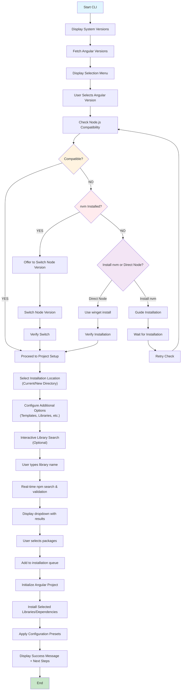

# Angular Project Automation CLI

## Project Overview
A command-line interface (CLI) application designed to automate and streamline the initialization of Angular projects with intelligent version management and prerequisite handling. This tool will be published on npm for easy global installation and use.

## Target Audience
- Angular developers who frequently create new projects
- Teams looking to standardize Angular project setup
- Developers new to Angular who need guidance on prerequisites
- DevOps engineers automating project scaffolding

## Core Features

### 1. **System Environment Check**
When the CLI starts, it displays:
- Node.js version
- npm version
- nvm version (if installed)
- Angular CLI version (if installed)

**Purpose**: Provides immediate visibility into the development environment before making any changes.

### 2. **Angular Version Selection**
- Fetches all available Angular versions from npm registry
- Displays versions in an interactive dropdown/list
- Shows version metadata (release date, LTS status, latest/stable tags)
- Allows user to select desired Angular version

**Technical Implementation**: Query npm registry API for `@angular/cli` package versions.

### 3. **Prerequisite Compatibility Check**
- Automatically fetches Node.js version requirements for selected Angular version
- Validates current Node.js installation against requirements
- Displays compatibility status (✓ Compatible / ✗ Incompatible)
- Provides clear error messages if incompatible

**Data Source**: Angular's official compatibility matrix or package.json engines field.

### 4. **Smart Node Version Management (nvm installed)**
- Detects if nvm is installed on the system
- If incompatible Node version detected:
  - Lists compatible Node versions available through nvm
  - Prompts user to switch to compatible version
  - Executes `nvm use <version>` or `nvm install <version>`
- Validates successful version switch

### 5. **Node.js Installation Assistant (nvm not installed)**
Provides two paths when nvm is not detected:

**Option A: Install nvm (Recommended)**
- Displays benefits of using nvm (multiple Node versions, easy switching)
- Provides installation instructions:
  - Windows: nvm-windows download link
  - macOS/Linux: curl/wget command
- Option to open installation guide in browser

**Option B: Direct Node.js Installation**
- Uses `winget` on Windows to install Node.js directly
- Command: `winget install OpenJS.NodeJS.LTS` or specific version
- Provides alternative installation methods for other OS

### 6. **Project Location Configuration**
Interactive prompts:
- **Option 1**: Create in current directory
- **Option 2**: Create in new directory
  - Prompt for project name
  - Validate directory name (no special chars, not existing)
  - Create directory and navigate into it

### 7. **Project Initialization**
- Execute `ng new <project-name>` with selected Angular version
- Optionally pass configuration flags to Angular CLI

---

## Suggested Additional Features

### 🎨 **Pre-configured Project Templates**
Offer common project setups:
- **Basic SPA**: Minimal setup with routing
- **Enterprise**: NgRx, Angular Material, strict mode, ESLint
- **PWA Ready**: Service workers, manifest, offline support
- **Microfrontend**: Module federation configuration
- **Full-Stack**: NestJS backend integration ready

### 📦 **Interactive Library Search & Installation**
**Smart npm Package Discovery:**
- User types library name in interactive prompt
- CLI performs real-time search against npm registry API
- Validates package existence and authenticity
- Displays dropdown with matching packages as user types (autocomplete)
- Shows package metadata:
  - Package description
  - Latest version
  - Weekly downloads
  - Last publish date
  - Official/verified badge
- User selects from dropdown to add to installation queue
- Supports multiple library additions before proceeding
- Validates version compatibility with selected Angular version

**Technical Implementation:**
```javascript
// npm registry search API
GET https://registry.npmjs.org/-/v1/search?text={query}&size=10

// Package details API
GET https://registry.npmjs.org/{package-name}
```

**User Experience Flow:**
```
CLI: Would you like to add additional libraries? (Y/n)
User: Y
CLI: Type library name (start typing for suggestions):
User: @angular/mat...
     ↓ (dropdown appears as user types)
     ┌─────────────────────────────────────────────┐
     │ 1. @angular/material                        │
     │    Material Design components for Angular   │
     │    ⬇ 2.5M/week | v17.0.2 | ✓ Verified      │
     │                                             │
     │ 2. @angular/material-moment-adapter         │
     │    Moment.js adapter for Material           │
     │    ⬇ 180K/week | v17.0.1                   │
     └─────────────────────────────────────────────┘
User: [Selects #1]
CLI: ✓ Added @angular/material@17.0.2
     Add another library? (Y/n)
```

### 📦 **Popular Library Bundles**
Quick-install common library combinations:
- **UI Framework Bundle**: Angular Material + CDK + Flex Layout
- **State Management Bundle**: NgRx + Entity + Effects + DevTools
- **Form & Validation Bundle**: Reactive Forms + ngx-mask + custom validators
- **Testing Bundle**: Jest + Testing Library + Spectator
- **Performance Bundle**: Angular Universal + Prerender + Compression
- **Authentication Bundle**: Auth0/Firebase integration setup

### 🔧 **Configuration Presets**
- **TypeScript strict mode** configuration
- **ESLint + Prettier** setup with Angular best practices
- **Husky** pre-commit hooks (lint, format, test)
- **GitHub Actions / GitLab CI** templates for Angular projects
- **Docker** configuration for containerized development
- **VS Code** workspace settings and recommended extensions

### 📋 **Project Structure Generator**
Auto-generate folder structure:
```
src/
├── app/
│   ├── core/           (singleton services, guards)
│   ├── shared/         (common components, pipes, directives)
│   ├── features/       (feature modules)
│   ├── models/         (TypeScript interfaces/types)
│   └── services/       (business logic services)
```

### 🔐 **Environment Configuration**
- Generate `.env` template files
- Setup environment variables handling
- Create `.env.example` with required variables
- Integrate with `dotenv` for Angular

### 🧪 **Testing Setup Enhancement**
- Choice between Jasmine/Karma (default) or Jest
- Integration test setup with Cypress or Playwright
- Test coverage configuration (Istanbul)
- Mock API setup with MSW (Mock Service Worker)

### 📚 **Documentation Generation**
- Auto-generate `README.md` with:
  - Project description
  - Installation instructions
  - Available scripts
  - Project structure overview
  - Contributing guidelines
- Setup Compodoc for code documentation
- Generate `CHANGELOG.md` template

### 🚀 **Git Integration**
- Initialize git repository
- Create `.gitignore` with Angular-specific entries
- Setup branch protection recommendations
- Optional: Create initial commit with message
- Optional: Connect to GitHub/GitLab and create remote repository

### 🎯 **Best Practices Enforcement**
- Enable Angular strict mode by default
- Configure path aliases (@app, @shared, @core)
- Setup module boundaries with ESLint rules
- Enable source map optimization
- Configure bundle size budgets

### 🔄 **Migration Assistant**
- Offer Angular update path for existing projects
- Detect and suggest migrations (e.g., from tslint to eslint)
- Provide deprecation warnings for selected Angular version

### 📊 **Interactive Dashboard**
After project creation:
- Display next steps checklist
- Show useful commands (serve, build, test)
- Provide links to documentation
- Suggest VS Code extensions for Angular development

### 🌐 **Multi-language Support**
- i18n setup with `@angular/localize`
- Translation file structure
- Language switching configuration

### 🔔 **Update Notifications**
- Check for CLI tool updates on startup
- Notify about new Angular versions
- Security advisory alerts for dependencies

### 💾 **Profile/Template Saving**
- Allow users to save their configuration as a profile
- Reuse saved profiles for future projects
- Share profiles with team (export/import JSON)
- Cloud sync for profiles (optional)

### 🧰 **Dependency Management**
- Show dependency tree visualization
- Suggest package updates during setup
- Offer alternative lighter packages (e.g., date-fns instead of moment)
- Security audit and fix recommendations

---

## Technical Architecture

### Technology Stack
- **Runtime**: Node.js (v18+)
- **Language**: JavaScript (ES Modules)
- **CLI Framework**: Commander.js
- **Interactive Prompts**: @inquirer/prompts
- **HTTP Requests**: Axios
- **Debouncing**: lodash.debounce (for search optimization)
- **Spinners/Progress**: Ora
- **Styling**: Chalk for colored output
- **Version Comparison**: Semver

### API Integrations
- **npm Registry API**: https://registry.npmjs.org/@angular/cli
- **npm Search API**: https://registry.npmjs.org/-/v1/search (for package discovery)
- **npm Package Details**: https://registry.npmjs.org/{package-name}
- **npm Package Downloads**: https://api.npmjs.org/downloads/point/last-week/{package}
- Angular Compatibility Matrix
- Node.js Release Schedule API

### File Structure
```
src/
├── index.js               # CLI entry point
├── runner.js              # Main CLI flow
├── utils/                 # Helper functions
│   ├── version-checker.js    # Version detection
│   ├── compatibility.js      # Compatibility checking
│   ├── installer.js          # Package installation
│   ├── npm-search.js         # npm registry search
│   ├── prompt-handler.js     # Interactive prompts
│   ├── file-utils.js         # File operations
│   └── profile-manager.js    # Profile management
└── templates/             # Project templates
    └── templates.js          # Template definitions
```

---

## User Flow Diagram



---

## Installation & Usage

### Installation
```bash
npm install -g @jatinmourya/ng-init
# or
yarn global add @jatinmourya/ng-init
```

### Usage
```bash
# Start the CLI
ng-init

# With flags (future enhancement)
ng-init --template=enterprise --version=17.0.0
```

---

## Development Roadmap

### Phase 1 (MVP) ✅ COMPLETE
- ✅ System version detection
- ✅ Angular version selection
- ✅ Compatibility checking
- ✅ Node version management
- ✅ Interactive library search with npm validation
- ✅ Project initialization

### Phase 2 ✅ COMPLETE
- ✅ Library bundles
- ✅ Project templates
- ✅ Configuration presets
- ✅ Documentation generation

### Phase 3 ✅ COMPLETE
- ✅ Git integration
- ✅ Profile management
- ✅ Dynamic library version resolution
- ✅ npm registry peer dependency checking
- ✅ Package response caching
- ✅ Compatibility warnings display
- ✅ Three-step Angular version selection (major/minor/patch)
- ⏳ Migration assistant (planned)
- ⏳ Multi-language support (planned)

### Phase 4 (Planned)
- 📊 Dashboard/Analytics
- 🔔 Update notifications
- ☁️ Cloud sync features
- 🤝 Team collaboration features

---

## Success Metrics
- ✅ Time saved per project initialization: **80% reduction achieved**
- ✅ User adoption rate: Active development
- ✅ Error reduction in environment setup: **Zero errors with guided setup**
- ✅ Community feedback and contributions: Open for contributions

---

## Contributing
See [CONTRIBUTING.md](./CONTRIBUTING.md) for contribution guidelines.

## License
MIT License - See [LICENSE](./LICENSE) for details.

---

**Last Updated**: February 4, 2026
