# Angular Project Automator 🚀

A comprehensive command-line interface (CLI) tool designed to automate and streamline the initialization of Angular projects with intelligent version management, interactive library search, and comprehensive prerequisite handling.

[](https://www.npmjs.com/package/@jatinmourya/ng-init)
[](https://opensource.org/licenses/MIT)

## ✨ Features

### Core Features

- **🔍 System Environment Check** - Displays Node.js, npm, nvm, and Angular CLI versions before starting
- **📦 Angular Version Selection** - Fetches and displays all available Angular versions from npm registry
- **✅ Prerequisite Compatibility Check** - Validates Node.js compatibility with selected Angular version
- **🔄 Smart Node Version Management** - Automatically handles Node version switching with nvm
- **💾 Node.js Installation Assistant** - Guides installation when nvm is not available
- **📍 Project Location Configuration** - Choose current or custom directory for project creation
- **🎯 Project Initialization** - Creates Angular project with selected configuration

### Advanced Features

- **🎨 Pre-configured Project Templates**
  - Basic SPA (Minimal setup)
  - Enterprise (NgRx, Material, ESLint)
  - PWA Ready (Service workers, offline support)
  - Material Design (Angular Material components)
  - Testing Ready (Jest, Testing Library)
  - Standalone Components (Modern Angular)

- **🔍 Interactive Library Search & Installation**
  - Real-time npm package search with autocomplete
  - Package validation and metadata display
  - Weekly download statistics
  - Version selection (latest or specific)
  - Multiple library queue management

- **Dynamic Library Version Resolution**
  - Automatically resolves compatible versions based on Angular version
  - Checks peer dependencies from npm registry
  - Matches major versions for Angular-scoped packages
  - Displays compatibility warnings
  - Caches npm responses for performance

- **📦 Popular Library Bundles**
  - UI Framework Bundle (Material + CDK + Flex Layout)
  - State Management Bundle (NgRx suite)
  - Form & Validation Bundle
  - Testing Bundle (Jest + Testing Library)
  - Performance Bundle (Universal + optimization)
  - Authentication Bundle (Firebase integration)
  - Utilities Bundle (Lodash, date-fns, RxJS)
  - HTTP & API Bundle

- **🔧 Configuration Presets**
  - TypeScript strict mode
  - ESLint + Prettier setup
  - Husky pre-commit hooks
  - Custom configurations

- **📁 Project Structure Generator**
  - Standard Angular structure (core, shared, features)
  - Domain-driven structure
  - Automatic folder and file generation

- **🔐 Environment Configuration**
  - Environment file templates
  - Configuration management

- **🚀 Git Integration**
  - Initialize repository
  - Create .gitignore with Angular-specific entries
  - Initial commit creation

- **📚 Documentation Generation**
  - Auto-generate README.md
  - CHANGELOG.md template
  - Project structure documentation

- **💾 Profile Management**
  - Save configurations as reusable profiles
  - Load saved profiles for quick setup
  - Export/import profiles for sharing
  - Cloud-ready profile system

## 📋 Prerequisites

- **Node.js**: v18.0.0 or higher
- **npm**: Comes with Node.js
- **nvm** (optional but recommended): For managing multiple Node.js versions

## 🚀 Installation

### Global Installation (Recommended)

```bash
npm install -g @jatinmourya/ng-init
```

### Or use with npx (no installation)

```bash
npx @jatinmourya/ng-init
```

## 📖 Usage

### Create New Project (Interactive)

```bash
ng-init
```

or

```bash
ng-init create
```

This starts the interactive CLI that guides you through:
1. System environment check
2. Angular version selection
3. Node.js compatibility check and resolution
4. Project configuration
5. Template selection
6. Library search and installation
7. Additional features setup
8. Profile saving option

### Check System Versions

```bash
ng-init check
```

Displays current versions of Node.js, npm, nvm, and Angular CLI.

### Profile Management

#### List all saved profiles

```bash
ng-init profile list
```

#### Show profile details

```bash
ng-init profile show <profile-name>
```

#### Delete a profile

```bash
ng-init profile delete <profile-name>
```

#### Export a profile

```bash
ng-init profile export <profile-name> <output-file>
```

Example:
```bash
ng-init profile export my-enterprise-setup ./enterprise-profile.json
```

#### Import a profile

```bash
ng-init profile import <profile-file>
```

Example:
```bash
ng-init profile import ./enterprise-profile.json
```

### Show Usage Examples

```bash
ng-init examples
```

## 🎯 Usage Examples

### Example 1: Create Enterprise Project with Material

1. Run `ng-init`
2. Select Angular version 17
3. Choose "Enterprise" template
4. Select "Interactive search" for libraries
5. Search and add additional packages
6. Enable Git initialization
7. Enable README generation
8. Save as profile for future use

### Example 2: Quick Setup with Saved Profile

1. Run `ng-init`
2. Select "Yes" to use saved profile
3. Choose your saved profile
4. Confirm configuration
5. Project is created automatically

### Example 3: PWA Project with Testing

1. Run `ng-init`
2. Select latest Angular version
3. Choose "PWA Ready" template
4. Select "Testing Bundle" from bundles
5. Enable ESLint + Prettier
6. Enable Husky hooks
7. Project created with complete testing setup

## 📊 CLI Application Flow Diagram

The following diagram illustrates the complete user journey when using the `ng-init` CLI application:

```mermaid
flowchart TB
    subgraph START["🚀 CLI Start"]
        A["User runs ng-init"] --> B["Display Welcome Banner"]
        B --> C["Display System Versions<br/>(Node.js, npm, nvm, Angular CLI)"]
    end

    subgraph PROFILE["💾 Profile Check"]
        C --> D{"Use saved profile?"}
        D -->|"Yes"| E["List available profiles"]
        E --> F["Select profile"]
        F --> G["Display profile info"]
        G --> H{"Confirm profile?"}
        H -->|"Yes"| SKIP["Skip to Project Name<br/>(if not in profile)"]
        H -->|"No"| I["Continue with manual setup"]
        D -->|"No"| I
    end

    subgraph ANGULAR["📦 Angular Version Selection"]
        I --> J["Fetch Angular versions from npm"]
        J --> K["Select Major Version<br/>(e.g., Angular 17, 18, 19)"]
        K --> L["Select Minor Version<br/>(e.g., 17.0.x, 17.1.x)"]
        L --> M["Select Patch Version<br/>(e.g., 17.1.0, 17.1.1)"]
        M --> N["Angular version confirmed"]
    end

    subgraph NODE["🔧 Node.js Compatibility"]
        N --> O["Check Node.js requirements"]
        SKIP --> O
        O --> P{"Node.js compatible?"}
        P -->|"Yes"| PROJECT
        P -->|"No"| Q{"nvm installed?"}
        Q -->|"Yes"| R["Check installed Node versions"]
        R --> S{"Compatible version<br/>available?"}
        S -->|"Yes"| T["Select & switch Node version"]
        T --> PROJECT
        S -->|"No"| U["Install recommended Node version"]
        U --> T
        Q -->|"No"| V{"How to proceed?"}
        V -->|"Install nvm"| W["Display nvm install guide"]
        W --> X["Exit - Install manually"]
        V -->|"Direct install<br/>(Windows)"| Y["Install Node via winget"]
        Y --> Z["Exit - Restart terminal"]
        V -->|"Exit"| X
    end

    subgraph PROJECT["📁 Project Configuration"]
        AA["Enter project name"] --> BB{"Select location?"}
        BB -->|"Current directory"| CC["Use current directory"]
        BB -->|"Custom"| DD["Enter custom path"]
        CC --> EE["Project path confirmed"]
        DD --> EE
    end

    subgraph TEMPLATE["🎨 Template Selection"]
        EE --> FF{"Select template"}
        FF -->|"Basic SPA"| GG["Minimal setup"]
        FF -->|"Enterprise"| HH["NgRx + Material + ESLint"]
        FF -->|"PWA Ready"| II["Service workers + offline"]
        FF -->|"Material Design"| JJ["Angular Material components"]
        FF -->|"Testing Ready"| KK["Jest + Testing Library"]
        FF -->|"Standalone"| LL["Modern standalone components"]
        FF -->|"Custom"| MM["Configure manually"]
        MM --> NN["Enable routing?"]
        NN --> OO["Select stylesheet format"]
        OO --> PP["Enable strict mode?"]
        PP --> QQ["Use standalone components?"]
        GG & HH & II & JJ & KK & LL & QQ --> RR["Template configured"]
    end

    subgraph LIBRARY["📚 Library Selection"]
        RR --> SS{"Library selection method?"}
        SS -->|"Interactive Search"| TT["Search npm packages"]
        TT --> UU["Select package"]
        UU --> VV["Choose version method"]
        VV -->|"Latest"| WW["Use latest version"]
        VV -->|"Specific"| XX["Select Major → Minor → Patch"]
        VV -->|"Manual"| YY["Enter version manually"]
        WW & XX & YY --> ZZ["Check Angular compatibility"]
        ZZ --> AAA{"Add more libraries?"}
        AAA -->|"Yes"| TT
        AAA -->|"No"| BBB["Libraries selected"]
        
        SS -->|"Manual Input"| CCC["Enter package names"]
        CCC --> BBB
        
        SS -->|"Library Bundles"| DDD["Select predefined bundles"]
        DDD --> EEE["UI Framework / State Mgmt /<br/>Forms / Testing / etc."]
        EEE --> BBB
        
        SS -->|"Skip"| BBB
    end

    subgraph FEATURES["⚙️ Additional Features"]
        BBB --> FFF["Select features"]
        FFF --> GGG["☑️ Git initialization"]
        FFF --> HHH["☑️ Project structure"]
        FFF --> III["☑️ README.md"]
        FFF --> JJJ["☐ CHANGELOG.md"]
        FFF --> KKK["☐ ESLint + Prettier"]
        FFF --> LLL["☐ Husky hooks"]
        GGG & HHH & III & JJJ & KKK & LLL --> MMM["Features configured"]
    end

    subgraph SAVE["💾 Save Profile"]
        MMM --> NNN{"Save as profile?"}
        NNN -->|"Yes"| OOO["Enter profile name"]
        OOO --> PPP["Profile saved"]
        PPP --> QQQ["Display configuration summary"]
        NNN -->|"No"| QQQ
    end

    subgraph CONFIRM["✅ Confirmation"]
        QQQ --> RRR{"Confirm creation?"}
        RRR -->|"No"| SSS["Project creation cancelled"]
        RRR -->|"Yes"| TTT["Start project creation"]
    end

    subgraph CREATE["🔨 Project Creation"]
        TTT --> UUU["Create Angular project"]
        UUU --> VVV["Resolve library versions"]
        VVV --> WWW["Install additional libraries"]
        WWW --> XXX["Run npm install"]
        XXX --> YYY{"Structure enabled?"}
        YYY -->|"Yes"| ZZZ["Create project folders & files"]
        YYY -->|"No"| AAAA
        ZZZ --> AAAA{"Git enabled?"}
        AAAA -->|"Yes"| BBBB["Initialize Git repo"]
        BBBB --> CCCC["Create .gitignore"]
        AAAA -->|"No"| DDDD
        CCCC --> DDDD{"README enabled?"}
        DDDD -->|"Yes"| EEEE["Generate README.md"]
        DDDD -->|"No"| FFFF
        EEEE --> FFFF{"Changelog enabled?"}
        FFFF -->|"Yes"| GGGG["Generate CHANGELOG.md"]
        FFFF -->|"No"| HHHH
        GGGG --> HHHH{"ESLint enabled?"}
        HHHH -->|"Yes"| IIII["Setup ESLint + Prettier"]
        HHHH -->|"No"| JJJJ
        IIII --> JJJJ{"Husky enabled?"}
        JJJJ -->|"Yes"| KKKK["Setup Husky hooks"]
        JJJJ -->|"No"| LLLL
        KKKK --> LLLL{"Git enabled?"}
        LLLL -->|"Yes"| MMMM["Create initial commit"]
        LLLL -->|"No"| NNNN
        MMMM --> NNNN["🎉 Success!"]
    end

    subgraph END["🏁 Complete"]
        NNNN --> OOOO["Display next steps"]
        OOOO --> PPPP["cd project-name"]
        PPPP --> QQQQ["ng serve"]
        QQQQ --> RRRR["Open localhost:4200"]
    end

    style START fill:#e1f5fe
    style PROFILE fill:#f3e5f5
    style ANGULAR fill:#fff3e0
    style NODE fill:#ffebee
    style PROJECT fill:#e8f5e9
    style TEMPLATE fill:#fce4ec
    style LIBRARY fill:#e0f2f1
    style FEATURES fill:#fff8e1
    style SAVE fill:#f3e5f5
    style CONFIRM fill:#e8eaf6
    style CREATE fill:#e3f2fd
    style END fill:#c8e6c9
```



### Flow Description

| Step | Phase | Description |
|------|-------|-------------|
| 1 | **Start** | User initiates CLI with `ng-init` command |
| 2 | **System Check** | Displays current Node.js, npm, nvm, and Angular CLI versions |
| 3 | **Profile** | Option to use a previously saved configuration profile |
| 4 | **Angular Version** | Three-tier selection: Major → Minor → Patch version |
| 5 | **Node.js Check** | Validates and resolves Node.js compatibility |
| 6 | **Project Setup** | Configure project name and location |
| 7 | **Template** | Choose from 6 pre-configured templates or custom setup |
| 8 | **Libraries** | Interactive search, manual input, or bundled packages |
| 9 | **Features** | Select Git, structure, docs, linting, hooks |
| 10 | **Save Profile** | Optionally save configuration for reuse |
| 11 | **Confirm** | Review summary and confirm creation |
| 12 | **Create** | Execute all selected operations |
| 13 | **Complete** | Display success message and next steps |

## 🏗️ Project Structure

```
ng-init/
├── src/
│   ├── index.js               # CLI entry point
│   ├── runner.js              # Main CLI flow
│   ├── utils/                 # Helper functions
│   │   ├── version-checker.js    # Version detection and management
│   │   ├── compatibility.js      # Compatibility checking & version resolution
│   │   ├── npm-search.js         # npm registry search
│   │   ├── installer.js          # Package installation
│   │   ├── prompt-handler.js     # Interactive prompts
│   │   ├── file-utils.js         # File operations
│   │   └── profile-manager.js    # Profile management
│   └── templates/             # Project templates
│       └── templates.js          # Template definitions
├── build.js                   # Build script for production
├── package.json
└── README.md
```

## 🔧 Configuration

### Project Templates

The CLI includes several pre-configured templates:

- **basic**: Minimal Angular setup with routing
- **enterprise**: Complete setup with NgRx, Material, ESLint
- **pwa**: Progressive Web App ready
- **material**: Angular Material UI components
- **testing**: Jest and Testing Library setup
- **standalone**: Modern standalone components

### Library Bundles

Pre-configured library combinations for common use cases:

- **uiFramework**: Angular Material suite
- **stateManagement**: NgRx complete setup
- **forms**: Form utilities and validators
- **testing**: Complete testing stack
- **performance**: Optimization tools
- **authentication**: Auth integration
- **utilities**: Common utility libraries
- **http**: HTTP and API tools

## 🤝 Contributing

Contributions are welcome! Please feel free to submit a Pull Request.

1. Fork the repository
2. Create your feature branch (`git checkout -b feature/amazing-feature`)
3. Commit your changes (`git commit -m 'Add some amazing feature'`)
4. Push to the branch (`git push origin feature/amazing-feature`)
5. Open a Pull Request

## 📝 License

This project is licensed under the MIT License - see the LICENSE file for details.

## 🐛 Bug Reports & Feature Requests

If you encounter any bugs or have feature requests, please create an issue on GitHub.

## 📚 Documentation

For detailed documentation, visit [PROJECT_DOCUMENTATION.md](./PROJECT_DOCUMENTATION.md)

## 🙏 Acknowledgments

- Angular Team for the amazing framework
- Node.js and npm communities
- All open-source contributors

## 📞 Support

- GitHub Issues: [Report issues](https://github.com/jatinmourya/ng-init/issues)

## 🎉 Success Metrics

- ⏱️ **80% reduction** in project initialization time
- ✅ **Zero environment setup errors** with guided installation
- 🚀 **Instant project scaffolding** with best practices
- 💾 **Reusable profiles** for team standardization
- 🔄 **Dynamic library version resolution** for Angular compatibility

---

**Made with ❤️ by the Angular community**

**Last Updated**: February 4, 2026
